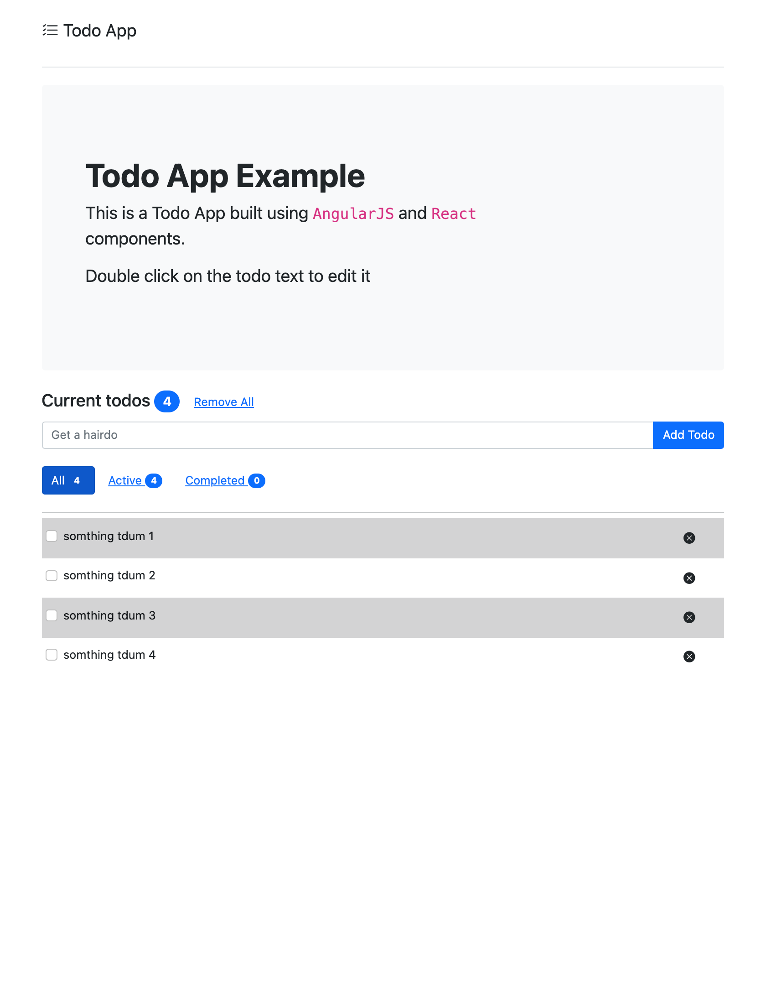
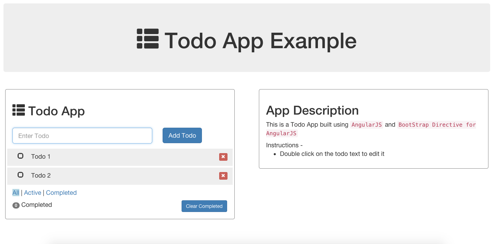

# Purpose
Taken Rohit angulajs TODO app and transition it into webpack + react leaf components

## Redo
### Angularjs + React
React in Angularjs

#### Demo
Start the project locally
```.bash
$ npm run start
```

#### Screenshot


## Original
### AngularJs-TodoApp
Todo App written in AngularJS using best practices

#### Demo
Visit this link for the Demo - http://rohitghatol.github.io/AngularJs-TodoApp/


#### Screenshot

